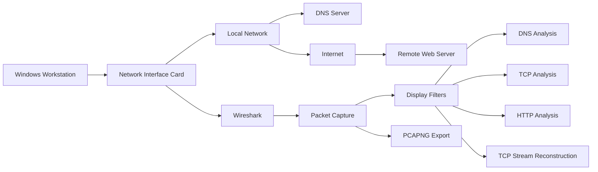

# Wireshark Network Analysis Lab

> Hands-on network analysis lab demonstrating packet capture, DNS analysis, TCP three-way handshake analysis, HTTP traffic inspection, TCP stream reconstruction, and packet capture preservation using Wireshark.

---

## Project Overview

This lab demonstrates practical network traffic analysis using Wireshark. I captured live network traffic, applied protocol-specific display filters, analyzed DNS queries and responses, examined TCP connection establishment, inspected HTTP traffic, reconstructed TCP streams, and saved packet captures for future analysis.

The lab demonstrates skills applicable to network engineering, SOC analysis, cloud security, cybersecurity operations, and incident response.

---

## Architecture

---

## Skills Demonstrated

| Skill | Implementation |
|---|---|
| Packet Capture | Captured live network traffic with Wireshark |
| Network Interface Analysis | Identified and monitored an active Ethernet interface |
| DNS Analysis | Examined DNS queries, responses, and A records |
| TCP Analysis | Identified the TCP SYN, SYN-ACK, and ACK handshake |
| Display Filtering | Isolated DNS, TCP, and HTTP traffic |
| HTTP Analysis | Inspected HTTP GET and POST requests |
| Security Analysis | Demonstrated exposure of application data over unencrypted HTTP |
| Stream Reconstruction | Reconstructed application communication using Follow TCP Stream |
| Network Troubleshooting | Used packet-level data to analyze client/server communication |
| Evidence Preservation | Saved network captures in PCAPNG format |

---

## Technologies Used

- Wireshark
- Windows
- Npcap
- TCP/IP
- DNS
- HTTP
- TCP
- TLS
- Command Prompt
- `nslookup`
- `.pcapng` packet captures

---

# Implementation

## Step 1 — Install Wireshark

Download the Windows x64 version of Wireshark from the official Wireshark website.

---

## Step 2 — Capture Network Traffic

Identified the active Ethernet network interface.

Start a live packet capture on the Ethernet interface.

The capture began displaying TCP, HTTP, TLS, and other network traffic between the system and remote hosts.

---

## Step 3 — Generate and Analyze DNS Traffic

While Wireshark continued capturing network traffic, opened Command Prompt to generate DNS traffic for analysis.

Performed a DNS lookup for Google using:

    nslookup google.com

The DNS lookup successfully returned IPv4 and IPv6 addresses associated with `google.com`.

Next, I applied the following Wireshark display filter:

    dns

This isolated DNS packets from the larger packet capture.

located the DNS query and corresponding DNS response for `google.com`.

I expanded the DNS response and reviewed the returned DNS records.

I compared the IPv4 addresses displayed by Wireshark with the addresses returned by `nslookup`.

The results matched, confirming that Wireshark successfully captured the DNS resolution process.

After completing the DNS analysis, prepared Wireshark for the next capture.

---

## Step 4 — Analyze a TCP Three-Way Handshake

For the next portion of the lab, I used an HTTP test website to generate TCP and HTTP traffic.

I determined the destination IP address by running:

    nslookup zero.webappsecurity.com

The hostname resolved to:

    54.82.22.214

Then filtered Wireshark traffic for the destination IP using:

    tcp and ip.addr == 54.82.22.214

The captured packets clearly showed the TCP three-way handshake:

    SYN → SYN-ACK → ACK

The packet sequence demonstrated that the client successfully established a TCP connection with the remote web server over TCP port 80.

After verifying the TCP handshake, prepared Wireshark for the next portion of the lab.

---

## Step 5 — Inspect Cleartext HTTP Traffic

> **Security Note:** This exercise was performed in an authorized test environment designed for security training. No production credentials were used.

I returned to the HTTP test application's login page to generate a form submission that could be inspected with Wireshark.

I entered test credentials into the intentionally insecure HTTP application.

I then applied the following Wireshark display filter:

    http.request.method == POST

This isolated HTTP POST requests.

After selecting the login POST request, I expanded the `HTML Form URL Encoded` section.

Wireshark exposed the submitted form parameters in plaintext.

This demonstrated a significant security weakness associated with transmitting authentication information over unencrypted HTTP.

Because HTTP does not provide TLS encryption, application data transmitted between the client and server can potentially be inspected through captured network traffic.

HTTPS addresses this risk by protecting application traffic with TLS encryption.

After completing the HTTP analysis, Prepared Wireshark for the next exercise.

---

## Step 6 — Follow a TCP Stream

I applied the following display filter:

    http

I selected an HTTP packet, right-clicked the packet, and navigated to:

    Follow → TCP Stream

Wireshark reconstructed the individual TCP packets into a complete application conversation.

The reconstructed stream allowed me to inspect the HTTP request sent by the client and the HTTP response returned by the server in a single view.

This demonstrated how network analysts can reconstruct application-layer communication from individual network packets.

---

## Step 7 — Save the Packet Capture

After completing the packet analysis, Saved the capture for future review and documentation.

I selected:

    File → Save As

I then selected the `.pcapng` format and saved the packet capture.

Saving the capture preserves the network traffic so that it can be reopened and analyzed later without requiring another live capture.

---

# Lab Validation

The completed lab successfully demonstrated:

- Live packet capture using Wireshark
- Network interface selection
- DNS query and response analysis
- DNS A record verification
- `nslookup` DNS troubleshooting
- Wireshark display filtering
- TCP three-way handshake analysis
- HTTP traffic inspection
- HTTP POST request analysis
- Cleartext application data exposure over HTTP
- TCP stream reconstruction
- PCAPNG packet capture preservation

---

# Key Findings

### DNS Resolution

DNS traffic captured in Wireshark showed the workstation sending DNS queries and receiving responses containing IP addresses associated with the requested hostname.

The results captured in Wireshark matched the addresses returned by `nslookup`.

### TCP Connection Establishment

The packet capture demonstrated the standard TCP three-way handshake:

    Client → Server: SYN
    Server → Client: SYN-ACK
    Client → Server: ACK

This confirmed successful TCP connection establishment between the client and remote server.

### HTTP Security

The HTTP analysis demonstrated that unencrypted HTTP traffic can expose application-layer information inside packet captures.

This reinforces the importance of using HTTPS/TLS to protect sensitive data transmitted between clients and servers.

### TCP Stream Reconstruction

Wireshark's **Follow TCP Stream** feature reconstructed packets belonging to the same TCP session and displayed the application conversation in a readable format.

This capability is valuable during network troubleshooting, security investigations, and incident response.

---

# Security Considerations

Packet captures can contain sensitive information, including:

- IP addresses
- Hostnames
- DNS queries
- URLs
- Cookies
- Authentication headers
- Session identifiers
- Application data
- Cleartext credentials

Packet captures should therefore be handled as potentially sensitive security evidence.

Only network traffic from systems and networks that you own or are explicitly authorized to monitor should be captured and analyzed.

Sensitive information should be removed or sanitized before screenshots or packet captures are published to a public GitHub repository.

---

# Repository Structure

    Wireshark-Network-Analysis/
    │
    ├── README.md
    │
    ├── screenshots/
    │   ├── ws1.png
    │   ├── ws2.png
    │   ├── ws3.png
    │   ├── ws4.png
    │   ├── ws5.png
    │   ├── ws6.png
    │   ├── ws7.png
    │   ├── ws8.png
    │   ├── ws9.png
    │   ├── ws10.png
    │   ├── ws11.png
    │   ├── ws12.png
    │   ├── ws13.png
    │   ├── ws14.png
    │   ├── ws15.png
    │   ├── ws16.png
    │   ├── ws17.png
    │   ├── ws18.png
    │   ├── ws19.png
    │   ├── ws20.png
    │   ├── ws21.png
    │   ├── ws22.png
    │   ├── ws23.png
    │   └── ws24.png
    │
    └── captures/
        └── network-analysis.pcapng

---

# Project Results

By completing this lab, I gained hands-on experience capturing and analyzing live network traffic using Wireshark.

I demonstrated the ability to:

- Identify network interfaces
- Capture live network packets
- Filter large packet captures
- Analyze DNS resolution
- Identify TCP connection establishment
- Inspect HTTP requests
- Identify security risks associated with unencrypted traffic
- Reconstruct TCP conversations
- Preserve packet captures for later investigation

These skills provide a practical foundation for network troubleshooting, security monitoring, SOC investigations, cloud security analysis, and incident response.

---

# Key Takeaway

Wireshark provides packet-level visibility into how systems communicate across a network. By analyzing DNS, TCP, HTTP, and application traffic, I was able to move beyond simply observing whether a connection worked and examine exactly how the communication occurred between the client and remote systems.
