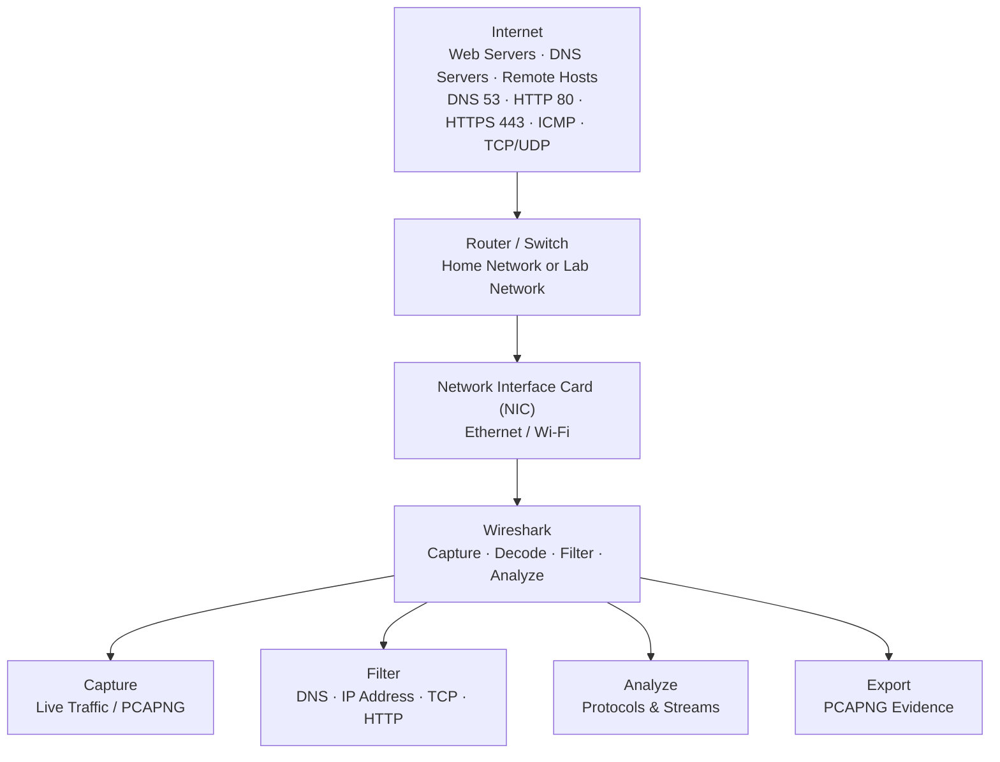
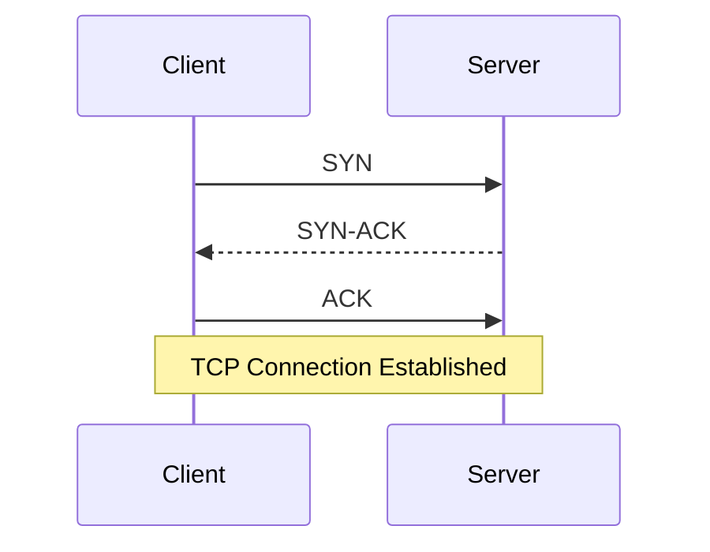
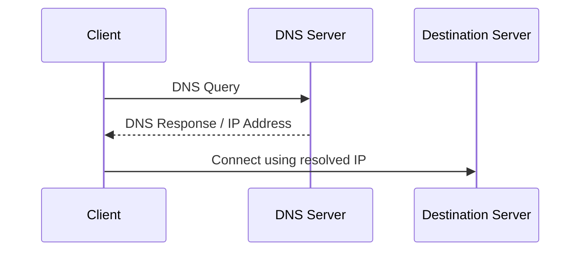

# Wireshark & Network Analysis

**Wireshark · Local Machine or Azure VM · Network Analysis**

## Lab Overview

| Field | Value |
|---|---|
| Certification Alignment | CompTIA Network+ · Security+ · CySA+ |
| Tool | Wireshark |
| Environment | Local Machine or Azure VM |
| Estimated Cost | $0 |
| Career Relevance | Network Engineer · SOC Analyst · Cloud Security Engineer · Incident Responder |

---

## Architecture — How Wireshark Captures Traffic



---

## The Business Problem This Lab Solves

Networks carry emails, database queries, login credentials, file transfers, API calls, and other application traffic.

When a service becomes unreachable, performance becomes slow, or a security alert occurs, packet analysis provides visibility into what is actually happening across the network.

Wireshark captures raw data moving across a network interface and allows the traffic to be inspected from the network frame through the application payload.

---

## Career Application

| Role | How This Lab Applies |
|---|---|
| Network Engineer | Diagnose connectivity issues by identifying dropped, delayed, or failed connections |
| SOC Analyst | Identify suspicious traffic patterns and investigate packet captures |
| Cloud Security Engineer | Apply packet-analysis concepts to cloud network monitoring |
| Help Desk | Determine whether connectivity problems are client-side or server-side |

---

# Key Network Concepts

## What Is a Packet?

A packet is a small unit of data transmitted across a network.

Packets contain information such as:

- Source IP address
- Destination IP address
- Port numbers
- Protocol information
- Payload data

Wireshark captures these packets and allows each one to be inspected individually.

---

## What Is a Network Protocol?

A network protocol defines the rules used to format and transmit information between systems.

| Protocol | Purpose |
|---|---|
| DNS | Resolves domain names to IP addresses |
| HTTP | Transfers unencrypted web content |
| HTTPS | Transfers web content protected with TLS |
| TCP | Provides reliable connection-oriented communication |
| ICMP | Supports ping and network diagnostics |

---

## TCP Three-Way Handshake

Before two systems exchange data over TCP, they establish a connection using a three-way handshake.



The expected sequence is:

`SYN → SYN-ACK → ACK`

A SYN without a corresponding SYN-ACK can indicate that the destination is unreachable or the connection was refused.

A TCP `RST` indicates that a connection was reset or forcibly closed.

---

## DNS — Domain Name System

DNS translates human-readable domain names into IP addresses.



A DNS **A record** maps a hostname to an IPv4 address.

| Record | Purpose |
|---|---|
| A | Maps hostname to IPv4 address |
| AAAA | Maps hostname to IPv6 address |
| MX | Identifies mail servers |
| CNAME | Creates an alias for another hostname |

---

## HTTP vs HTTPS

HTTP transfers web content without TLS encryption.

HTTPS protects HTTP communications using TLS.

**HTTP:**

`Client → Unencrypted Traffic → Server`

**HTTPS:**

`Client → TLS Encrypted Traffic → Server`

The HTTP exercise demonstrates why sensitive information should be protected with HTTPS.

---

# What This Lab Demonstrates

| Skill | Application |
|---|---|
| Capture Live Network Traffic | Capture traffic from an active network interface |
| Apply Display Filters | Isolate relevant packets from large captures |
| Read TCP Handshakes | Determine whether TCP connections succeed or fail |
| Analyze DNS | Identify DNS queries and responses |
| Inspect HTTP | Observe unencrypted application traffic |
| Follow TCP Streams | Reconstruct conversations between two hosts |
| Save Packet Captures | Preserve `.pcapng` evidence for future analysis |

---

# Step 1 — Install Wireshark

Install Wireshark for the appropriate operating system.

| OS | Installation |
|---|---|
| Windows | Install Wireshark x64 and Npcap |


# Step 2 — Capture Network Traffic

1. Open Wireshark.
2. Locate the available network interfaces.
3. Select the active Ethernet or Wi-Fi interface.
4. Start the packet capture.
5. Open a browser and generate network traffic.
6. Allow the capture to run for approximately 30 seconds.
7. Stop the capture.


The resulting capture contains the frames that passed through the selected interface during the capture window.

---

# Step 3 — Apply Display Filters

Wireshark display filters allow specific traffic to be isolated without deleting packets from the original capture.

| Filter | What It Shows | Use |
|---|---|---|
| `dns` | DNS queries and responses | DNS troubleshooting |
| `http` | Unencrypted HTTP traffic | HTTP analysis |
| `tcp` | TCP traffic | Connectivity investigation |
| `tcp.flags.syn == 1` | TCP SYN packets | Connection attempts |
| `tcp.flags.reset == 1` | TCP reset packets | Reset or refused connections |
| `icmp` | ICMP traffic | Reachability testing |
| `ip.addr == 192.168.1.1` | Traffic to/from an IP | Host-specific analysis |
| `ip.src == 10.0.0.5` | Traffic from an IP | Source traffic analysis |
| `tcp.port == 443` | TCP port 443 traffic | HTTPS identification |
| `http.request` | HTTP GET/POST requests | HTTP request analysis |

## Display Filters vs Capture Filters

**Capture filters** are applied before packet capture and determine what traffic is recorded.

**Display filters** are applied after capture and determine what traffic is displayed.

This lab uses display filters so the original packet capture remains available for additional analysis.

---

# Step 4 — Guided Exercises

## Exercise A — Capture a DNS Lookup

Start a Wireshark capture on the active network interface.

Open Command Prompt or Terminal separately from Wireshark.

Run:

```bash
nslookup google.com
```

Return to Wireshark and stop the capture.

Apply the following display filter:

```text
dns
```

Locate the DNS query:

```text
Standard query A google.com
```

Then locate the response:

```text
Standard query response A google.com
```

Expand:

```text
Domain Name System (response)
```

Review the **Answers** section and identify the returned A record and IPv4 address.

Confirm that the address corresponds with the result returned by `nslookup`.

### What This Demonstrates

The workstation sends a DNS query requesting the A record for `google.com`.

The DNS server responds with an IP address that the workstation can use to establish the actual network connection.

---

## Exercise B — Analyze the TCP Three-Way Handshake

Start another packet capture.

Navigate to:

```text
http://example.com
```

Stop the capture.

Determine the destination IP:

```bash
nslookup example.com
```

Apply:

```text
tcp and ip.addr == [destination IP]
```

Locate the following packets:

| Packet | Flags | Meaning |
|---|---|---|
| 1 | SYN | Client requests a connection |
| 2 | SYN, ACK | Server acknowledges and accepts |
| 3 | ACK | Client confirms the connection |

Expected sequence:

`SYN → SYN-ACK → ACK → TCP Connection Established`

If a SYN is sent but no SYN-ACK is returned, the connection may have been refused or the destination may be unreachable.

If a `RST` packet appears, the connection was reset or forcibly closed.

---

## Exercise C — Inspect HTTP Traffic

> **Educational exercise only. Only capture traffic on networks and systems you own or have explicit permission to analyze.**

Use an authorized HTTP test environment and test credentials.

Start a packet capture and submit the test HTTP request.

Stop the capture.

Apply:

```text
http.request.method == POST
```

Select the POST packet and inspect the packet detail pane.

Locate:

```text
HTML Form URL Encoded
```

The exercise demonstrates how information transmitted using HTTP can appear in plaintext and why HTTPS/TLS is required for sensitive application traffic.

---

## Exercise D — Follow a TCP Stream

Capture HTTP traffic.

Select an HTTP packet.

Navigate to:

```text
Right-click → Follow → TCP Stream
```

Wireshark reconstructs the individual TCP packets into a complete conversation between the client and server.

This provides visibility into the complete application exchange rather than viewing individual packets separately.

---

# Step 5 — Save and Export Captures

## Save a Capture

```text
File → Save As → choose .pcapng
```

## Export Filtered Packets

```text
Apply Display Filter
        ↓
File
        ↓
Export Specified Packets
        ↓
Displayed
```

## Reopen a Capture

```text
File → Open → Select .pcapng
```

## TShark Command-Line Capture

```bash
tshark -i eth0 -w capture.pcapng -c 1000
```

| Option | Purpose |
|---|---|
| `-i` | Interface name |
| `-w` | Output file |
| `-c` | Number of packets before stopping |

---

# Verification — Confirm the Lab Is Working

| Skill | How to Verify |
|---|---|
| DNS Capture | Apply `dns` and identify a query packet and its response with matching transaction IDs |
| TCP Handshake | Identify three sequential packets containing SYN, SYN-ACK, and ACK |
| Display Filters | Filter traffic by IP address, port, and protocol |
| Stream Reconstruction | Follow a TCP stream and read the HTTP request and response |
| File Management | Save the capture, close Wireshark, reopen the file, and confirm the packets remain available |

---

# Portfolio Captures

Save the following captures:

```text
captures/
├── dns-lookup.pcapng
├── tcp-handshake.pcapng
└── tcp-stream.pcapng
```

| Capture | Demonstrated Skill |
|---|---|
| `dns-lookup.pcapng` | DNS query and response analysis |
| `tcp-handshake.pcapng` | TCP connection establishment |
| `tcp-stream.pcapng` | TCP stream reconstruction |

---

# Repository Structure

```text
wireshark-network-analysis/
│
├── README.md
│
├── captures/
│   ├── dns-lookup.pcapng
│   ├── tcp-handshake.pcapng
│   └── tcp-stream.pcapng
│
└── screenshots/
```
